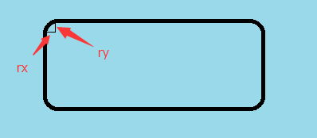

# 自定义View
### 1. 项目介绍
 SelfView项目是用来提交平时感觉比较好的自定义View的。
### 2. 各个自定义View中的知识点
 #### 2.1 MyTextView
 #### 2.2 MyView(主要是OnMeasure方法的理解)
 onMeasure(int widthMeasureSpec, int heightMeasureSpec)方法中，widthMeasureSpec和heightMeasureSpec看起来是个int值，但它也包含了View的测量模式和View的大小值。其中测量模式（用measureSpec的32位中前两位记录）有三种，三种测量模式如下：
 
 
 | 测量模式 | 表示意思 | 对应的xml中设置尺寸
 | ------  | ------ |------|
 | UNSPECIFIED  | 父容器没有对当前的View有任何限制，当前View可以任意取尺寸 | |
 |EXACTLY|当前尺寸就是当前View应该取得尺寸 | match_parent、固定尺寸（ex:100dp） |
 |AT_MOST|当前尺寸是当前View能取到的最大值 | wrap_content|

 #### 2.3 MyLinearLayout
 相比于自定义View，自定义ViewGroup更为复杂一些，主要是自定义ViewGroup除了绘制自己外，还得兼顾自己子View的排列。子View的排列是在onLayout方法中实现：
 ```
 onLayout(boolean changed, int left, int top, int right, int bottom)
 ```
其中，changed表示该ViewGroup的大小和位置是否改变了，left表示该ViewGroup离父视图左边的距离。

**注意：**
 当ScrollView嵌套一个自定义控件时，该控件的MeasureSpec是UNSPECIFIED，这时要记得设置控件的大小，不然控件显示不全且无法实现滚动。
 #### 2.4 GraphView(基本图形的绘制)
 ##### 2.4.1 绘制线
 ```
 canvas.drawLine(0,0,100,100,paint);
 ```
 ##### 2.4.2 绘制三角形和多边形
 canvas没有提供专门画三角形的方法，但可以运用画多边形的方法来画三角形。画多边形方法如下：
 ```
 //1.先定义一个Path对象，用来记录多边形各顶点信息
 Path path = new Path();
 path.moveTo(10,0);//起点位置
 path.lineTo(100,100);
 path.lineTo(200,150);
 path.lineTo(200,100);
 path.lineTo(100,50);
 //path.rLineTo(100,100);
 //path.rLineTo(-100,9);
 path.close();//设置Path是闭合的
 //2.调用canvas的drawPath方法
 canvas.drawPath(path,paint);
 ```
 **注意：**rLineTo，和lineTo基本一样，区别在于rLineTo是基于该坐标系中最后一个点。如果没有上一个点，原点(0,0)就是默认的上一个点。
 ##### 2.4.3 绘制矩形和圆角矩形
 1 ) 矩形
 ```
 Rect rect = new Rect(0,0,100,100);
 canvas.drawRect(rect,paint);
 ```
 2 ) 圆角矩形
 ```
 RectF rectf = new RectF(0,0,100,100);
 canvas.drawRoundRect(rectf,20,10,paint);
 ```
 **其中**
 ，drawRoundRect(RectF rect, float rx, float ry, Paint paint)的rx、ry表示如下:
 
 ##### 2.4.4 绘制圆
 ```
 canvas.drawCircle(50,50,40,paint);
 ```
 **其中**，前两个参数为圆心位置，第三个参数为半径。
 ##### 2.4.5 弧形
 ```
 canvas.drawArc(rectf,0,270,true,paint);
 ```
 **其中**，第二个参数为起始角度，第三个参数为从起始角度扫过的角度（eg：起始角度为90度，扫过为80度，那么最后的图形是90到170度之间的区域），第四个参数为是否需要带圆心
 #### 2.5 PathView（对Path类）
 ##### 2.5.1 沿着一个路径写文字
 ```
 //1.先定义一个Path
 Path path = new Path();
 ...
 canvas.drawTextOnPath(String text,Path path, float hOffset,
                       float vOffset, Paint paint);
 ```
 ##### 2.5.2 drawLines
 具体参考：[Android绘图：绘制多条直线的 drawLines方法](http://www.jcodecraeer.com/a/anzhuokaifa/androidkaifa/2012/1224/739.html)
 ##### 2.5.3 贝塞尔曲线
 Path中提供quadTo(二阶)、cubicTo(三阶)函数
 具体参考： [安卓自定义View进阶 - 贝塞尔曲线](http://blog.csdn.net/u013831257/article/details/51281136)

 1）二阶
 ```
 quadTo(float x1, float y1, float x2, float y2)
 ```
 其中，(x1,y1)是控制点的坐标，(x2,y2)是结束点坐标。

 2）三阶
 ```
 cubicTo(float x1, float y1, float x2, float y2,float x3, float y3)
 ```
 其中，(x1,y1)和(x2,y2)是控制点，(x3,y3)是结束点。

 ### 参考文档：
 1. [Android 自定义View (一)](http://blog.csdn.net/lmj623565791/article/details/24252901)
 2. [自定义View，有这一篇就够了](http://blog.csdn.net/huachao1001/article/details/51577291)
 3. [手把手教你写一个完整的自定义View](http://blog.csdn.net/carson_ho/article/details/62037696)
 4. [ScrollView和HorizontalScrollView中添加的自定义View控件无法显示问题](http://blog.csdn.net/qq_25929547/article/details/53142161)
 5. [Android Canvas之Path操作](https://www.jianshu.com/p/9ad3aaae0c63)
